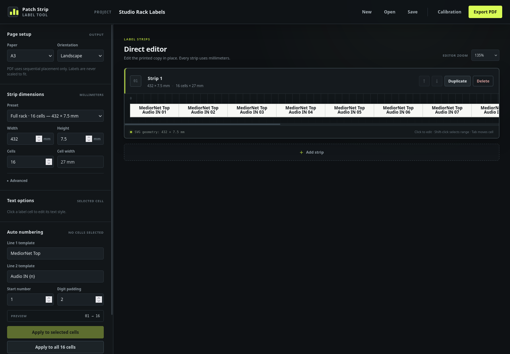

# Patch Strip Label Tool

A completely client-side React application for designing and exporting true-size labels for broadcast racks, patch panels, and equipment. Projects and PDFs remain in the browser; there is no backend, account, database, analytics, cloud storage, or required server runtime.



## Development

Install dependencies and start Vite:

```bash
npm install
npm run dev
```

Run the automated dimensional and domain tests:

```bash
npm test
```

Run ESLint:

```bash
npm run lint
```

## Production build

```bash
npm ci
npm run build
```

The deployable static output is `dist/`. It contains browser assets only; Node.js is not required after the build. Upload the contents of `dist/` to any static host, including:

- Vercel
- Netlify
- conventional static web hosting
- nginx or Apache
- similar static hosting and object-storage/CDN services

Before deployment, serve `dist/` with any plain static file server and verify the editor, project Save/Open, lazy-loaded PDF export, Print, and Help/About workflows.

### Security headers

`vercel.json` configures the production CSP and related headers on Vercel.
`public/_headers` is copied to `dist/_headers` for Netlify-compatible hosts.
The policy permits only same-origin application code, local/data images and
fonts, and Blob URLs needed by generated PDF/Print workflows; framing and
plugin objects are blocked.

For nginx or Apache, configure the equivalent response headers on every static
asset and the SPA fallback response:

```text
Content-Security-Policy: default-src 'self'; script-src 'self'; style-src 'self' 'unsafe-inline'; img-src 'self' data: blob:; font-src 'self' data:; connect-src 'self'; worker-src 'self' blob:; object-src 'none'; base-uri 'self'; frame-ancestors 'none'; form-action 'none'
X-Content-Type-Options: nosniff
Referrer-Policy: strict-origin-when-cross-origin
Permissions-Policy: camera=(), microphone=(), geolocation=(), payment=(), usb=()
X-Frame-Options: DENY
```

Inline styles remain permitted because React uses inline style properties for
editor zoom and validated colors. Scripts do not require `unsafe-inline` or
`unsafe-eval`.

## Static SPA fallback

The application currently uses a single screen, but a fallback to `index.html` prevents future client-side routes or direct navigation from returning a 404.

- `vercel.json` provides a minimal Vercel rewrite.
- `public/_redirects` is copied to `dist/_redirects` for Netlify-compatible hosts.
- On nginx, use `try_files $uri $uri/ /index.html;` in the site location.
- On Apache, enable `mod_rewrite` and rewrite non-file/non-directory requests to `/index.html`.

These files are optional on hosts that already provide a “single-page application” fallback. They do not make the build dependent on Vercel or Netlify.

## Custom domain

For a deployment such as `labels.rschmidt.dk`:

1. Build and deploy `dist/` using the chosen static host.
2. Add `labels.rschmidt.dk` as a custom domain in that host.
3. Create the DNS record requested by the host, normally a CNAME or provider-specific A/AAAA record.
4. Confirm HTTPS is active, then test JSON Save/Open, PDF export, and Print from the public URL.

No provider credentials, API secrets, or runtime environment variables belong in the repository. The public feedback destination is configured once in `src/config/app-info.ts`.

## Dimensional model

All physical geometry is persisted in millimeters. The strip SVG uses a millimeter-coordinate `viewBox` and explicit `width="…mm"` / `height="…mm"` attributes. Editor zoom and editor-only cell indices never alter or enter physical geometry.

PDF geometry is created directly from millimeters with `points = millimeters × 72 / 25.4`. No DOM or CSS pixel measurements enter the PDF path. The exporter preserves true strip dimensions, uses deterministic unscaled placement, supports parallel polygon-aware diagonal packing, and drives the page preview from the same layout plan.

Export PDF downloads a dated PDF. Print opens the same exact-size PDF in the browser's normal print workflow. Always choose `100%` / `Actual Size`; never choose Fit, Shrink, or Scale to printable area. Some printer drivers silently scale PDFs, so verify the setting manually. The calibration PDF contains a mathematically exact 100 × 100 mm square.

## Project files and numbering

Save downloads a human-readable, versioned `.patch-labels.json` project. Open validates the complete file and migrates supported older schema versions. Cell IDs, text, per-cell styles, group headers, and physical dimensions are retained.

Auto numbering accepts `{n}` anywhere in either line template; the adjacent `#` button inserts it automatically. Click a cell to select and edit it, then Shift-click another cell to select a contiguous range. Numbering, clearing, group headers, and cell appearance changes can be applied to the selected range without changing neighboring cells.

New strips begin empty. The neutral `Router Out` / `{n}` numbering template is
only applied when the user explicitly chooses Apply. Normal label and Print
PDFs automatically include the bundled Buy Me a Coffee QR in a collision-safe
bottom-right decoration area. It never changes strip placement and never
appears in calibration PDFs.

CSV, PWA behavior, accounts, printer correction factors, analytics, cloud save, nested headers, and arbitrary uploaded fonts are intentionally not implemented.
